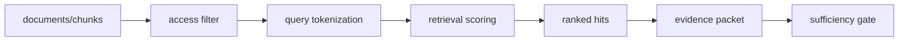

# Architecture

## Chunk model
Stores source, text, sensitivity, provenance, and stable chunk ID.

## Access layer
Excludes chunks outside the caller's allowed sensitivity set.

## Retriever
Scores query/chunk token overlap and returns ranked traceable hits.

## Evidence gate
Marks the packet insufficient when the minimum number of hits is not reached.

## Principle
Retrieval should return an inspectable evidence object, not silently convert search results into permission to act.
